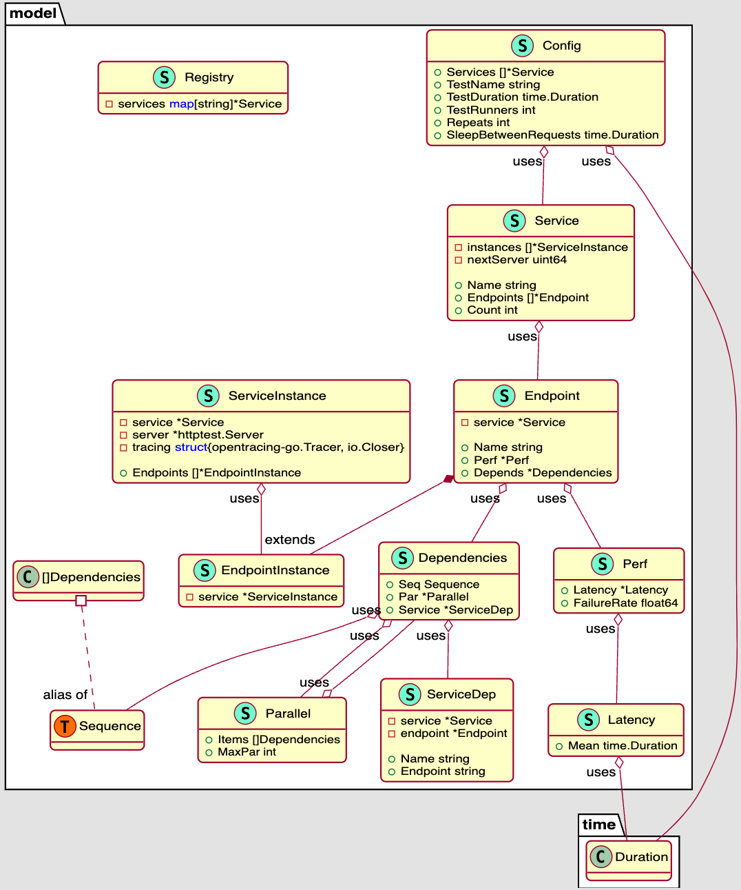

# microsim - Microservices Simulator

Used in https://github.com/PacktPublishing/Mastering-Distributed-Tracing/tree/master/Chapter12.

Published on Docker Hub: https://hub.docker.com/r/yurishkuro/microsim/tags

## Design

The tool takes a configuration file that describes the "architecture" of your desired system, such as services,
number of instances for each service, their endpoints and their dependecies. The tool simulates the traces that
may be generated from such system. Some random mutations are introduced during execution: latency of requests
is drawn randomly from a normal distribution with specified mean and stdev (error rates can be specified, but
currently not implemented).

The tool starts a configured number of "workers" (goroutines), and each worker sequentially runs simulations
of requests through the architecture, starting from the root service. Workers can run either for a certain
time period, or until they generate a predefined number of simulations. There is a configurable sleep interval
between simulations in each worker.

## Configuration

The tool comes with a built-in configuration for Jaeger's HotROD application that can be printed with:

```sh
docker run yurishkuro/microsim -o | jq
```

* A custom configuration can be provided via `-c` option.
* The schema for the config is hardcoded in the data model: [model/config.go](./model/config.go).
* The UML diagram below is generated with https://www.dumels.com/.



## Usage

To see all command line options:

```sh
docker run yurishkuro/microsim -h
```

## License

MIT license.
